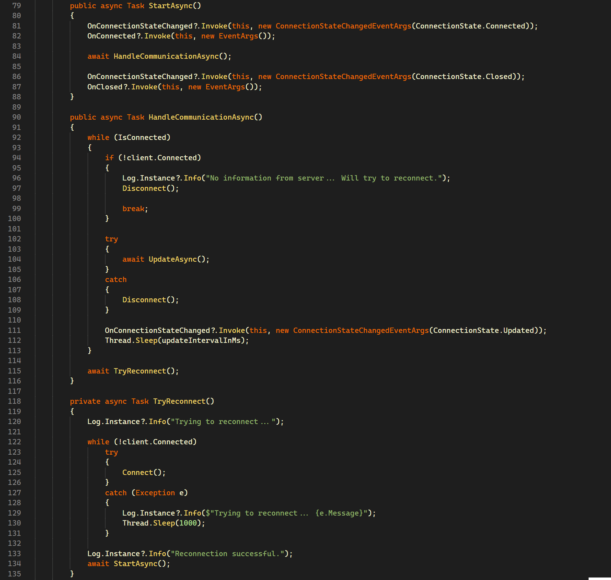

# Happy_Hacking for vscode

Inspired by 

## Installation
### On Linux:
`cd ~/.vscode/extensions/ &&  git clone git@github.com:rachartier/vsc-happy-hacking-theme.git`

### On Windows:
`cd %USERPROFILE%\\extensions\\ &&  git clone git@github.com:rachartier/vsc-happy-hacking-theme.git`

## Screenshots

### C

### C#

